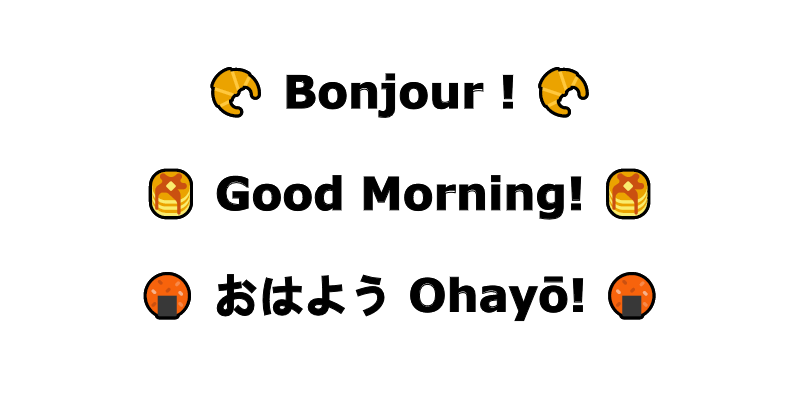

    <picture>
      <source media="(prefers-color-scheme: dark)" srcset="evening.png">
      <source media="(prefers-color-scheme: light)" srcset="morning.png">
      
  </picture>
  <picture>
    <source media="(prefers-color-scheme: dark)" srcset="https://user-images.githubusercontent.com/25423296/163456776-7f95b81a-f1ed-45f7-b7ab-8fa810d529fa.png">
    <source media="(prefers-color-scheme: light)" srcset="https://user-images.githubusercontent.com/25423296/163456779-a8556205-d0a5-45e2-ac17-42d089e3c3f8.png">
    
  </picture>

